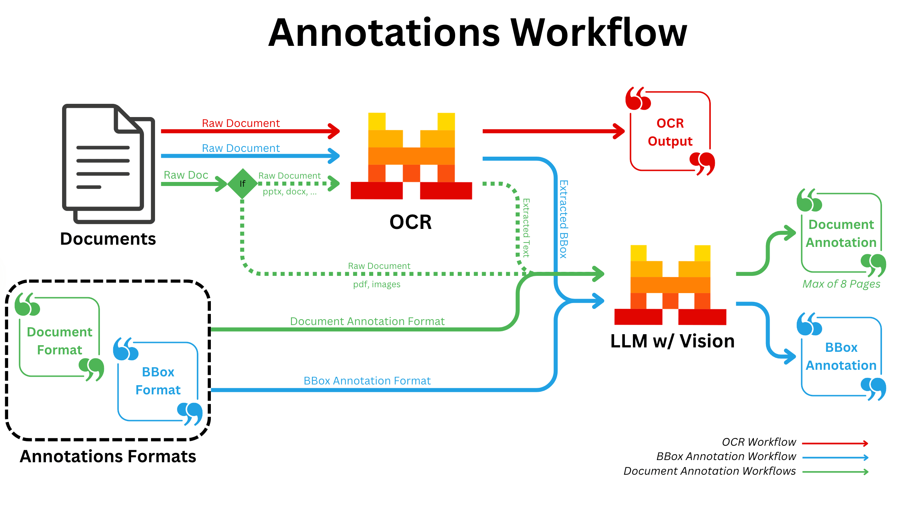
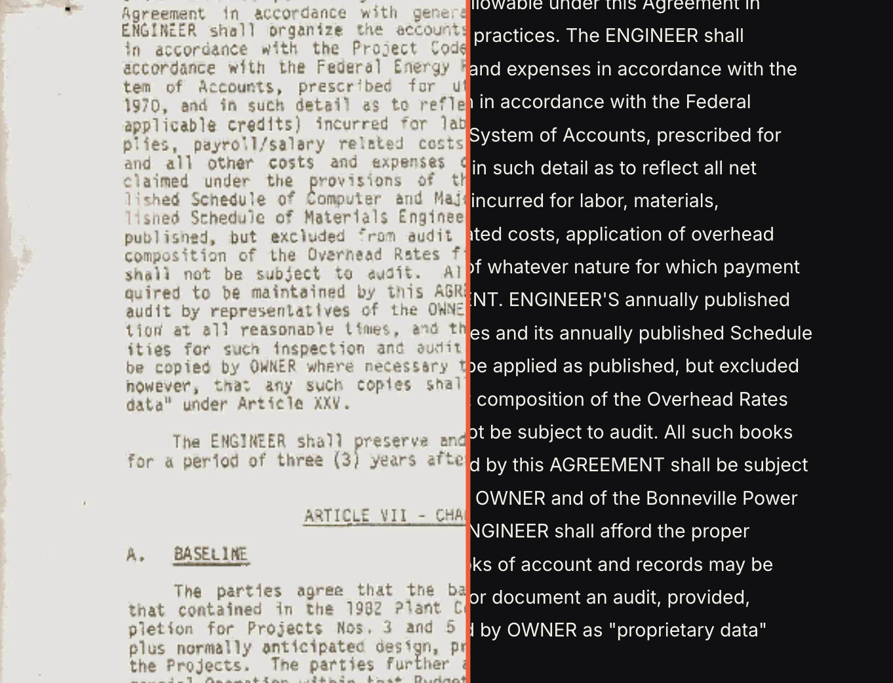

# PDF Academic Metadata Extractor 🤖

<div align="center">
  
  <br><br>
  </a>
</div>

<div align="center">
  
  <br><br>
  </a>
</div>


使用 Mistral Document AI 从 PDF 封面、扉页、版权页或 CIP 页中提取文献元数据，批量生成可直接用 Excel 打开的 CSV。字段与“新增文献记录”表单对应：标题、作者、期刊/会议/出版机构、文献类型、年份、页码、DOI、摘要和备注。

程序会优先选择最可能包含出版信息的页面，并把模型结果与 OCR 文本再次比对。没有证据支持的 DOI、年份、页码和出版机构会留空，避免把推测值直接写入 CSV。

## 1. 环境要求

- Python 3.9 或更高版本
- Mistral API key
- 可访问 Mistral API 的网络

在项目根目录执行：

```bash
python3 -m venv .venv
.venv/bin/python -m pip install --upgrade pip
.venv/bin/python -m pip install -r requirements.txt
```

Windows PowerShell：

```powershell
py -m venv .venv
.venv\Scripts\python -m pip install --upgrade pip
.venv\Scripts\python -m pip install -r requirements.txt
```

## 2. 配置 API key

项目使用根目录下的 `.env` 文件。首次配置时可以执行：

```bash
cp .env.example .env
chmod 600 .env
```

然后编辑 `.env`：

```dotenv
MISTRAL_API_KEY=your_mistral_api_key
```

`.env` 已加入 `.gitignore`，不会被 Git 跟踪。也可以通过 `--env-file` 使用其他位置的配置文件；终端里已经导出的 `MISTRAL_API_KEY` 优先于文件中的值。

## 3. 批量处理一个 PDF 文件夹

最常用的完整命令如下。只需修改 `--input-dir`：

```bash
.venv/bin/python batch_mistral_metadata.py \
  --input-dir "ASC_handbook" \
  --output-dir "result/asc_handbook_metadata"
```

如果省略 `--output-dir`，程序会自动写入 `result/<输入文件夹名>_metadata/`：

```bash
.venv/bin/python batch_mistral_metadata.py --input-dir "/path/to/pdf_folder"
```

程序按相对文件名稳定排序后逐篇处理。默认只扫描输入目录的第一层，并为每篇 PDF 自动挑选最多 8 页：前 3 页，以及在本地文本层中最像版权、ISBN、CIP、出版或 DOI 信息页的页面。每篇 PDF 发起一次 Mistral OCR 请求。

### 先试跑前 6 篇

```bash
.venv/bin/python batch_mistral_metadata.py \
  --input-dir "ASC_handbook" \
  --limit 6 \
  --output-dir "result/asc_handbook_first_6"
```

### 递归扫描子文件夹

```bash
.venv/bin/python batch_mistral_metadata.py \
  --input-dir "/path/to/pdf_folder" \
  --recursive
```

### 调整元数据页面数

本批处理将每篇 PDF 的元数据页数限制在 1 到 8 页：

```bash
.venv/bin/python batch_mistral_metadata.py \
  --input-dir "ASC_handbook" \
  --metadata-pages 6
```

页面越多，遇到较晚版权页的概率越高，但处理成本也可能增加。通常建议保留默认值 8。

### 显式指定若干 PDF

这与 `--input-dir` 二选一：

```bash
.venv/bin/python batch_mistral_metadata.py \
  "documents/article_1.pdf" \
  "documents/book_2.pdf" \
  --output-dir "result/selected_pdfs"
```

### 使用其他 `.env` 文件

```bash
.venv/bin/python batch_mistral_metadata.py \
  --input-dir "ASC_handbook" \
  --env-file "/secure/path/mistral.env"
```

## 4. 输出文件

假设输出目录是 `result/asc_handbook_metadata/`，程序会生成：

```text
result/asc_handbook_metadata/
├── literature_metadata.csv
├── batch_metadata.json
└── raw/
    ├── 001.json
    ├── 002.json
    └── ...
```

- `literature_metadata.csv`：UTF-8 BOM 编码，可直接用 Excel 打开。作者使用逗号分隔。
- `batch_metadata.json`：完整结构化结果、字段证据、校正记录、复核状态和失败列表。
- `raw/*.json`：Mistral 原始 OCR/annotation 响应以及源页映射，便于审计和离线重建。

CSV 包含以下列：

```text
source_file, source_total_pages, metadata_pages_processed,
metadata_source_pages, title, authors, venue_or_publisher,
document_type, year, pages, doi, abstract, note,
average_page_confidence, review_status, review_notes
```

`review_status=verified` 表示当前字段均通过本次 OCR 文本规则检查；`review_needed` 表示应查看 `review_notes` 和 JSON 中的 `field_evidence`。它不代表 Crossref、ISBN 或专利数据库已经完成外部权威校验。

## 5. 不重复调用 API，重新生成 CSV

如果输出目录中的 `raw/*.json` 已存在，可以离线重建 CSV 和汇总 JSON：

```bash
.venv/bin/python batch_mistral_metadata.py \
  --input-dir "ASC_handbook" \
  --output-dir "result/asc_handbook_metadata" \
  --reuse-raw
```

输入文件夹、排序、`--limit` 和输出目录必须与原运行保持一致，否则程序会拒绝把原始响应匹配到错误 PDF。

只重新调用 API 刷新第 6 篇，同时复用其他原始响应：

```bash
.venv/bin/python batch_mistral_metadata.py \
  --input-dir "ASC_handbook" \
  --limit 6 \
  --output-dir "result/asc_handbook_first_6" \
  --reuse-raw \
  --refresh-index 6
```

`--refresh-index` 是排序后的 1 起始序号，可以重复指定。

## 6. 单篇 PDF：提取全文 OCR 文本

批处理脚本的目标是表单元数据。需要把一篇 PDF 的全部页面提取为 Markdown 时，运行：

```bash
.venv/bin/python mistral_document_ai_experiment.py \
  "ASC_handbook/example.pdf" \
  --output-dir "result/example_full_text"
```

主要输出包括 `text.md`、`form_metadata.json`、`metadata.json`、`qa_report.json` 和逐批原始响应。已有原始响应时可加 `--reuse-raw` 离线重建派生文件。

## 7. 查看所有命令参数

```bash
.venv/bin/python batch_mistral_metadata.py --help
.venv/bin/python mistral_document_ai_experiment.py --help
```

## 8. 常见问题与安全说明

- `MISTRAL_API_KEY is not set`：确认当前目录下有 `.env`，或通过 `--env-file` 指定正确路径。
- HTTP 401/403：API key 无效、过期或没有所需权限，请在 Mistral 控制台更新。
- `No PDF files found`：默认不扫描子文件夹；需要时增加 `--recursive`。
- 扫描型 PDF 没有本地文字层：程序仍会处理前几页，但较晚的版权页可能无法被本地规则发现；可先人工确认页面位置，或查看 `review_needed` 记录。
- PDF 选中的页面会上传到 Mistral。不要处理未经授权上传的敏感文档。
- `raw/*.json` 可能包含原文内容，应按原 PDF 的敏感级别保护。
- 不要提交 `.env`，不要把 API key 写入脚本、README、CSV 或日志。若 key 曾在聊天、终端历史或其他公开位置出现，请及时轮换。
